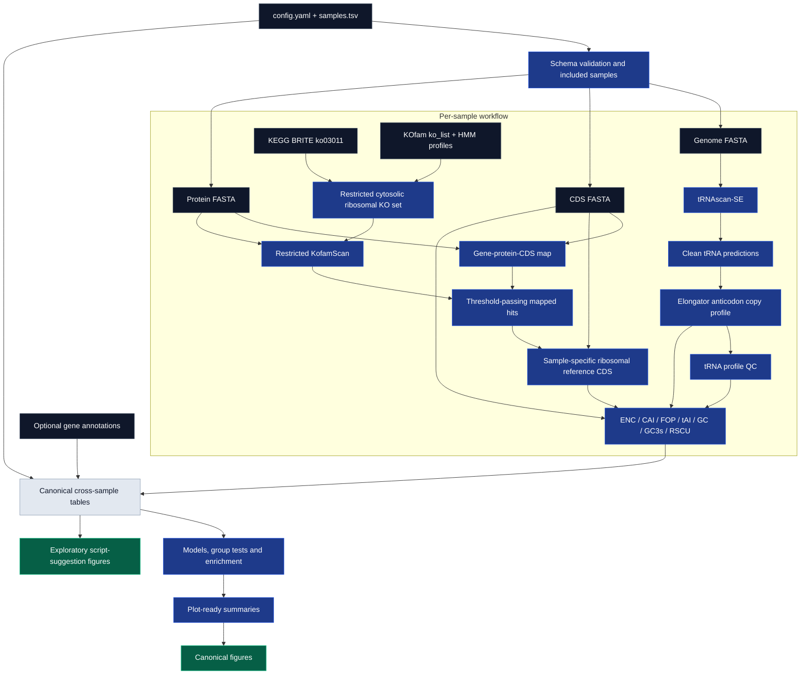

# 🧬→🖥️→📊 tAIpipe

v0.6.0

`tAIpipe` is a Snakemake workflow for comparative analysis of tRNA gene
repertoires, codon usage and translational adaptation. For every included
genome, it predicts tRNA genes, constructs a sample-specific cytosolic
ribosomal reference set, calculates gene- and codon-level metrics, builds
canonical cross-genome tables, performs predefined statistical analyses and
produces publication-oriented figures.


[](https://www.gnu.org/licenses/gpl-3.0)

## 🌟 Highlights

- Automated tRNA gene prediction with **tRNAscan-SE 2.0** and explicit
  pseudogene/ambiguous-call filtering.
- CDS-based calculation of **tAI**, **CAI**, **ENC**, **FOP**, **RSCU**, **GC**,
  **GC3s** and expected-ENC deviation (`delta_ENC`).
- Sample-specific CAI reference sets derived from significant **KofamScan**
  assignments to cytosolic eukaryotic ribosomal proteins.
- Explicit protein-gene-CDS identifier mapping instead of free-text header
  matching.
- Canonical gene-, genome- and codon-level tables shared by all downstream
  statistics and plots.
- Gene-level mixed models, per-genome effects, genome-group comparisons,
  lifestyle permutations within phylum and genome-stratified GO/PFAM
  enrichment.
- Configurable QC thresholds with per-sample tRNA-profile, metric and KOfam
  diagnostics.
- Reproducible Snakemake execution with rule-specific Conda environments,
  logs and benchmarks.
- Designed for comparative fungal genomics; the current mandatory ribosomal
  reference is eukaryotic, so the complete workflow is not configured for a
  bacterial or archaeal CAI analysis.

## ℹ️ Overview

The main goal of `tAIpipe` is to connect the **tRNA Adaptation Index** and other
codon-usage metrics with organism-level metadata and gene-level annotations.
The workflow can be used to investigate whether relative translational
adaptation is associated with taxonomy, lifestyle, genome composition, protein
function, signal peptides, transmembrane regions, low-complexity regions, PFAM
domains or GO terms.

The analysis is deliberately split into three layers:

1. **Per-sample computation** produces tRNA profiles, ribosomal reference CDS
   sets and codon metrics without pooling genomes.
2. **Canonical tables and statistics** combine samples under explicit QC,
   covariate and stratification rules.
3. **Plotting** reads precomputed tables and summaries. Plotting scripts do not
   replace the configured inferential analyses.

The default production configuration is intended for a multi-genome fungal
dataset. The tRNAscan domain mapper recognizes Eukarya, Bacteria and Archaea,
but the mandatory KOfam reference currently contains only cytosolic eukaryotic
ribosomal profiles.

Detailed documentation is split into separate files:

| Guide | Contents |
| --- | --- |
| [`docs/getting_started.md`](docs/getting_started.md) | Configuration and workflow execution |
| [`docs/input_format.md`](docs/input_format.md) | FASTA, metadata and annotation contracts |
| [`docs/workflow_overview.md`](docs/workflow_overview.md) | Rule order and data flow |
| [`docs/script_reference.md`](docs/script_reference.md) | Inputs and outputs of custom scripts |
| [`docs/output_format.md`](docs/output_format.md) | Output layout and table schemas |
| [`docs/metrics.md`](docs/metrics.md) | Metric and statistical interpretation |
| [`docs/plotting_style_guide.md`](docs/plotting_style_guide.md) | Plotting conventions and design choices |

The executable behavior is defined by `workflow/Snakefile`, the rule files it
includes, `workflow/schemas/` and the selected configuration. Those files take
precedence if an auxiliary prose document is older than the implementation.

## What is **tAI**?

The **tRNA Adaptation Index (tAI)** measures how well the codons in a coding
sequence match an estimated cellular tRNA pool. `tAIpipe` uses genomic tRNA gene
copy numbers as a reproducible proxy for tRNA availability and applies
domain-specific codon-anticodon pairing, including wobble penalties, through
`cubar`.

Conceptually, the absolute weight of codon `i` is the summed contribution of
compatible tRNAs:

```math
W_i = \sum_j (1-s_{ij})G_j
```

where `G_j` is the gene copy number of compatible tRNA `j` and `s_ij` is the
pairing penalty. Relative codon weights are normalized, and a gene's tAI is
their geometric mean.

Higher tAI indicates stronger adaptation to the copy-number-derived tRNA pool.
It does **not** directly measure tRNA expression, translation speed or protein
abundance. Low tAI can also be biologically meaningful, for example in local
translation kinetics, co-translational folding or regulation.

## ✍️ Authors

- [Norbert Szala](https://github.com/NorbertSzala)
- [Max Stróżyk](https://github.com/maxi7524)

## Requirements

### Execution software

- Snakemake with Conda, Mamba or Micromamba support.
- Rule-specific environments from `workflow/envs/`.
- The R post-deploy hook `workflow/envs/r.post-deploy.sh`, which installs the
  `cubar` package used for codon metrics.

### Biological inputs

Every included sample requires:

- genome nucleotide FASTA for tRNAscan-SE and genome summaries;
- CDS nucleotide FASTA for codon metrics;
- protein FASTA for KofamScan and protein-CDS mapping;
- one row in `config/samples.tsv` with sample identity, taxonomy, lifestyle,
  domain, NCBI genetic-code ID and file patterns.

Each `genome`, `cds` and `proteome` pattern must resolve to exactly one file.
The CDS FASTA should contain NCBI-style `[protein_id=...]` attributes, and the
same identifier must be the first token of the corresponding protein FASTA
header. The active numbered workflow does not consume sample GFF files; GFF is
used only by auxiliary/test-data tooling.

### Reference resources

- `resources/kofamscan/ko_list` with KOfam thresholds.
- KOfam HMM profiles under `resources/kofamscan/profiles/`. This large directory
  is **not bundled** in the repository and must be supplied before DAG
  construction.
- `resources/kofamscan/ribosome_reference/ko03011.json`, the local KEGG BRITE
  snapshot used to define cytosolic eukaryotic ribosomal KOs.
- `resources/genetic_codes/trnascanse/<ID>.gcode` for every non-standard
  translation table used by a sample. Genetic code 1 needs no exception file.
- A GO dictionary TSV, local GO OBO file or reachable OBO URL when GO analysis
  is enabled.
- An optional external annotation TSV. GO, PFAM and binary-feature analyses
  require the relevant annotation columns to be present and interpretable.

See [`resources/kofamscan/README.md`](resources/kofamscan/README.md) and
[`resources/genetic_codes/trnascanse/README.md`](resources/genetic_codes/trnascanse/README.md)
for the exact resource contracts.

## Quick start

### 0. Download

```bash
git clone https://github.com/NorbertSzala/tAIpipe.git
cd tAIpipe
```

### 1. Configure inputs

Edit `config/config.yaml`:

```yaml
paths:
  data_cds: /path/to/CDS
  data_genome: /path/to/genomes
  data_proteome: /path/to/proteomes
  external_annotations: /path/to/annotations.tsv  # or null
```

Then edit `config/samples.tsv`. Required columns are:

```text
sample, species, genetic_code, accession, domain, kingdom, phylum,
lifestyle, genome, cds, proteome, include
```

Only rows with `include=true` enter the DAG. `sample` must be unique and match
`^[A-Za-z0-9_.-]+$`.

### 2. Provide KOfam profiles

Install an official KOfam profile release so that the repository contains:

```text
resources/kofamscan/profiles/Kxxxxx.hmm
```

Use `ko_list` and HMM profiles from the same KOfam release. The workflow checks
that every KO selected from the BRITE hierarchy has a matching profile and, if
configured, a usable threshold.

### 3. Validate the production DAG

```bash
snakemake --dry-run --profile workflow/profiles/production
```

A successful dry-run confirms configuration, schema, sample selection, file
resolution and dependency construction. It does not validate biological
content or execute tRNAscan-SE, KofamScan or R scripts.

### 4. Run the production workflow

```bash
snakemake --profile workflow/profiles/production
```

A direct invocation without a profile is also supported:

```bash
snakemake \
  --snakefile workflow/Snakefile \
  --configfile config/config.yaml \
  --use-conda \
  --cores 16 \
  --rerun-incomplete \
  --printshellcmds \
  --show-failed-logs
```

## Information flow

```text
Sample metadata and file patterns
   ├── Genome FASTA
   │      └── tRNAscan-SE → cleaned elongator tRNA copy profile → tRNA QC
   ├── CDS FASTA ───────────────────────────────────────────────────────┐
   └── Protein FASTA → gene/protein/CDS map → restricted KofamScan    │
                                      └── ribosomal reference CDS ─────┤
                                                                       ↓
                             ENC / CAI / FOP / tAI / GC / GC3s / RSCU
                                                                       ↓
                         canonical gene, genome and codon tables
                                      ├── statistical analyses
                                      ├── GO/PFAM enrichment
                                      └── canonical and exploratory plots
```

The tRNA and KofamScan branches run independently for each sample. Codon metrics
start only when the validated tRNA profile, CDS input and sample-specific
ribosomal reference CDS are available.

## 🚀 Usage

### Production dry-run

```bash
snakemake --dry-run --profile workflow/profiles/production
```

### Production run

```bash
snakemake --profile workflow/profiles/production
```

The production profile selects `workflow/Snakefile`, `config/config.yaml`,
Conda execution, 32 global cores, rerun of incomplete jobs, failed-log display,
default resource requests and a 120-second filesystem latency wait.

### Re-run one analysis stage

Target a rule explicitly when its implementation or relevant parameters have
changed. This forces the selected stage without forcing all upstream rules:

```bash
snakemake --profile workflow/profiles/production --force plot_chosen_go_terms
```

### Test workflow status

`workflow/profiles/test/config.yaml` points to `config/config_test.yaml` and
`tests/data/`. The test-data generator is documented in
[`tests/README.md`](tests/README.md).

The current test configuration is not synchronized with all keys and nested
fields required by `workflow/schemas/config.schema.yaml`, while
`tests/unit/` and `tests/integration/` contain no implemented test cases.
Therefore the test profile is not currently a valid integration test or release
gate. It should not be advertised as working until the configuration and
automated assertions are completed.

## Execution backends

### Conda

Conda is the implemented execution backend. Active rules define environments
under `workflow/envs/`, and the production profile enables `--use-conda`.

```bash
snakemake --profile workflow/profiles/production
```

### Apptainer/Singularity

An experimental profile exists at `workflow/profiles/apptainer/`, but active
rules do not currently declare complete container images. The profile alone
does not provide a validated containerized execution path and must not be
treated as equivalent to the Conda backend.

## 🧩 Pipeline overview

Main workflow stages:

1. Validate `config/config.yaml` and the sample metadata schema.
2. Select rows with `include=true` and resolve one genome, CDS and proteome file
   per sample.
3. Predict tRNA genes with tRNAscan-SE using the sample domain and optional
   genetic-code exception file.
4. Clean predictions, remove unsupported records, count elongator
   amino-acid/anticodon copies and validate the tRNA profile.
5. Build the protein-gene-CDS identifier map.
6. Prepare the restricted ribosomal KO/HMM reference, run KofamScan, retain
   significant mapped hits and select the best ribosomal CDS per KO.
7. Calculate per-gene and per-codon ENC, CAI, FOP, tAI, GC, GC3s, RSCU and
   supporting weights.
8. Build `gene_features.tsv`, `genome_summary.tsv` and `codon_profiles.tsv`.
9. Run configured gene models, genome tests, per-genome effects, restricted
   permutations and GO/PFAM enrichment.
10. Summarize statistical outputs and render canonical and exploratory figures.



## 📁 Scripts and rules

The active rule files are included explicitly by `workflow/Snakefile`:

| Rules | Responsibility |
| --- | --- |
| `00_prepare_go_dictionary.smk` | Validate or generate the local GO dictionary |
| `01`-`04` | tRNAscan-SE, cleaning, copy-profile construction and tRNA QC |
| `05`-`06` | Identifier mapping and KofamScan-derived ribosomal reference |
| `07_compute_codon_metrics.smk` | Per-sample codon metrics and metric QC |
| `08_build_tables.smk` | Canonical gene, genome and codon tables |
| `09_compute_statistics.smk` | Gene models, genome tests, per-genome effects and permutations |
| `10_summarize_statistics.smk` | Plot-ready statistical summaries |
| `11_go_enrichment.smk` | Genome-stratified GO enrichment |
| `12_plots.smk` | Canonical figures |
| `13_script_suggestion.plots.smk` | Separate exploratory/legacy-compatible figure layer |
| `14_go_pfam_lcr_plots.smk` | Chosen-GO and PFAM/LCR enrichment figures and statistics |

Important custom scripts include:

```text
workflow/scripts/preprocessing/convert_trnascanse_output_to_tsv.py
workflow/scripts/preprocessing/prepare_trna_codon_counts_to_tai.py
workflow/scripts/qc/validate_trna_profile.py
workflow/scripts/kofamscan/build_gene_protein_map.py
workflow/scripts/kofamscan/prepare_ribosomal_reference.py
workflow/scripts/kofamscan/parse_kofamscan_ribosome.py
workflow/scripts/kofamscan/select_top_n_reference_cds.py
workflow/scripts/metrics/calculate_tAI.R
workflow/scripts/tables/build_gene_features.R
workflow/scripts/tables/build_genome_summary.R
workflow/scripts/tables/build_codon_profiles.R
workflow/scripts/statistics/
workflow/scripts/plots/
```

The following files are present but are **not included** by the active
`workflow/Snakefile`:

```text
workflow/rules/90_optional_fetch_biomart_annotations.smk
workflow/rules/99_legacy_aggregate_and_report.smk
workflow/rules/12_plots_codon_profile_rule_replacement.smk
```

Report, annotation-preparation, phylogeny, taxonomy and resource-building
scripts are auxiliary until called explicitly or connected to the active DAG.

## 📊 Outputs

The active output layout is:

```text
results/
├── per_genome/
│   └── <sample>/
│       ├── trnascan/          # raw and cleaned tRNA predictions
│       ├── counted_codons/    # elongator amino-acid/anticodon copy counts
│       ├── tables/            # gene-protein-CDS map
│       ├── kofamscan/         # ribosomal hits, reference CDS and QC
│       ├── codon_metrics/     # gene vectors and codon-level tables
│       └── qc/                # tRNA-profile and metric QC
├── tables/                    # canonical cross-sample tables
├── statistics/                # tests, effects, permutations and enrichment
├── plots/                     # canonical and exploratory figures
└── reports/                   # reserved; report generation is not in the active DAG
```

### Main outputs

| File | Unit | Purpose |
| --- | --- | --- |
| `results/tables/gene_features.tsv` | one original CDS per sample | Identifiers, sequence QC, codon metrics, within-genome tAI variables and joined annotations |
| `results/tables/genome_summary.tsv` | one included genome | Assembly summaries, metric distributions, annotation fractions and tRNA/KOfam QC |
| `results/tables/codon_profiles.tsv` | one genome × DNA codon | Codon counts/frequencies, genome and reference RSCU, CAI weights and tRNA weights |
| `results/statistics/gene_feature_tests.tsv` | one configured binary feature | Mixed-model association with within-genome standardized tAI |
| `results/statistics/genome_group_tests.tsv` | one metric × grouping variable | Wilcoxon or Kruskal-Wallis genome-level comparison |
| `results/statistics/gene_feature_per_genome_effects.tsv` | one genome × feature | Within-genome effect estimate and eligibility diagnostics |
| `results/statistics/lifestyle_within_phylum_permutation_tests.tsv` | one response | Lifestyle effect tested by permutations restricted within phylum |
| `results/statistics/go_enrichment.tsv` | one GO term × tAI tail | Genome-stratified CMH enrichment/depletion |
| `results/statistics/pfam_tai_tail_enrichment.tsv` | one PFAM × tail fraction × direction | Genome-stratified CMH enrichment in 1% and 10% tAI tails |

Plots are written under `results/plots/` in the formats configured by
`plots.output_formats`. Canonical plots consume precomputed summaries;
`results/plots/script_suggestions/` is an explicitly exploratory layer and must
not be treated as an additional independent confirmatory analysis.

Empty GO or PFAM enrichment tables with valid headers can be legitimate when no
term satisfies the configured annotation coverage, genome support and gene
count thresholds.

See [`docs/output_format.md`](docs/output_format.md) for detailed schemas.

## 🧪 Quality control and interpretation

The workflow stops on structural inconsistencies that can invalidate sample
identity or metric calculation, including:

- invalid configuration or sample-sheet schemas;
- duplicated sample IDs;
- zero or multiple files matching one sample pattern;
- malformed tRNA identifiers or counts;
- missing KOfam profiles or required thresholds;
- protein/CDS identifiers that cannot be mapped within configured tolerance;
- fewer than five valid ribosomal reference CDS.

Biological completeness thresholds are controlled by `trna_qc.mode`:

- `error`: record QC and stop on a non-passing tRNA or metric status;
- `warn`: record the status, print a warning and continue;
- `ignore`: record the status and continue silently.

The configuration schema currently also accepts `fail`, but the Python and R
QC scripts accept only `error`, `warn` and `ignore`; `fail` must not be used
until that interface mismatch is resolved.

Important interpretation limits:

- tRNA gene copy number is a proxy, not measured tRNA abundance;
- tAI depends on wobble assumptions, the genetic code and genome annotation;
- CAI depends on the size and quality of the KofamScan-derived reference CDS;
- ENC and GC3s can be unstable for short or compositionally unusual CDS;
- GO/PFAM results depend on annotation coverage and consistency;
- phylum and lifestyle comparisons remain exploratory because the main models
  do not correct for phylogenetic non-independence.

## 📖 Further reading

Recommended papers and resources:

- [The tAI implementation concept](https://doi.org/10.1093/nar/gkg897)
- [Codon usage bias overview](https://doi.org/10.1007/s11033-021-06749-4)
- [Recent introduction to codon usage and translational regulation](https://doi.org/10.1038/s41467-024-52660-4)
- [Review on codon usage and translation dynamics](https://doi.org/10.1146/annurev-biophys-030722-020555)
- [KOfam and KofamKOALA](https://www.genome.jp/tools/kofamkoala/)
- [tRNAscan-SE](http://lowelab.ucsc.edu/tRNAscan-SE/)

## 💭 Feedback and contributing

Suggestions, bug reports and pull requests are welcome. A useful issue should
identify the affected rule or script, include the relevant log and configuration
fragment, and state whether the problem concerns input parsing, execution,
statistics, biological interpretation or plotting.

Particularly useful contributions include:

- support for additional validated FASTA/header conventions;
- reviewed tRNAscan-SE exception files for additional genetic codes;
- stronger automated unit and integration tests;
- phylogenetically informed comparative models;
- annotation coverage and missingness diagnostics;
- reproducible container definitions for the experimental Apptainer backend.

## Project contributions

### Norbert Szala

- Designed the main Snakemake workflow and organized the project structure.
- Implemented tRNAscan-SE processing, prediction cleaning and preparation of
  tRNA anticodon copy profiles.
- Developed the calculation and integration of tAI, CAI, ENC, FOP, GC, GC3s,
  RSCU and supporting codon-level quantities.
- Added KofamScan-based identification of cytosolic eukaryotic ribosomal
  proteins used as the CAI reference set.
- Implemented protein, gene and CDS identifier mapping and extraction of
  sample-specific ribosomal reference CDS sequences.
- Added canonical gene-, genome- and codon-level tables, QC outputs,
  statistical analyses, restricted permutations and GO/PFAM enrichment.
- Prepared and maintained `config/*.yaml`, validation schemas under
  `workflow/schemas/`, Conda environments and environment locks.
- Created and updated test-data tooling and sample configurations used during
  workflow development.
- Reorganized and renamed workflow rules to make dependencies easier to audit
  and maintain.
- Added workflow documentation, input/output descriptions and metric
  interpretation notes.
- Integrated the analysis stages into the Snakemake DAG and performed pipeline
  testing, debugging and cleanup.

### Max Stróżyk

- Developed and debugged scripts for combining sample metadata and gene
  annotations.
- Improved protein identifier handling during metadata and annotation
  preparation.
- Created and developed the R Markdown report template.
- Added plot, summary and configurable report sections for HTML/PDF report
  generation.
- Helped organize input metadata and standardize dataset and sample filenames.
- Helped debug the R environment, report rendering and workflow configuration.

Report generation is currently outside the active numbered DAG, but the report
template and supporting scripts remain in the repository as prior project work.

## License

GPL-3.0. See `LICENSE`.

Citation metadata are provided in `CITATION.cff`.
