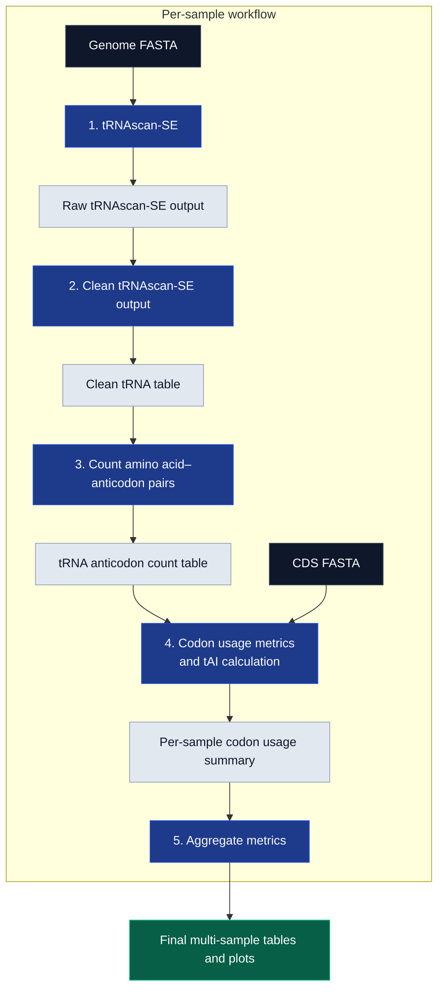

# 🧬→🖥️→📊 tAIpipe

v0.4.0

Bioinformatics pipeline for tRNA adaptation index (**tAI**), codon usage, and tRNA gene analysis across genomic and CDS datasets, with outputs designed for downstream visualization and interactive dashboards.


[](https://www.gnu.org/licenses/gpl-3.0)

## 🌟 Highlights

- Automated tRNA gene prediction using **tRNAscan-SE**
- CDS-based codon usage analysis, including **tAI**, **CAI**, **ENC**, **RSCU**, **GC**, and **GC3s** ([Brief definitions](https://www.genscript.com/gsfiles/tools/Index_Definition_of_GenRCA_Rare_Codon_Analysis_Tool.pdf))
- Support for genome-scale comparative analyses across organisms
- Designed for fungal datasets, but not restricted to fungi
- Snakemake-based workflow with reproducible per-genome outputs
- Outputs prepared for downstream plotting, statistical analysis, and dashboard integration

## ℹ️ Overview

`tAIpipe` is a modular Snakemake workflow for studying codon usage and translational adaptation across genomic datasets. The pipeline combines genome/CDS input data, tRNA gene prediction, codon usage metrics, and structured output tables that can be used for comparative analyses and visualization.

The main goal of this project is to integrate **tRNA Adaptation Index** analysis with organism-level metadata, such as taxonomy, genome size, lifestyle, and other biological features. This makes it possible to explore whether **tAI** depends on genome size, ecological niche, protein function, or selected genomic features.

Detailed documentation is split into separate files:

| File                        | Description                                      |
| --------------------------- | ------------------------------------------------ |
| `docs/input_format.md`      | Required inputs and sample table format          |
| `docs/output_format.md`     | Output files and final tables                    |
| `docs/workflow_overview.md` | Workflow logic and rule-level overview           |
| `docs/metrics.md`           | Explanation of tAI, CAI, ENC, RSCU, GC, and GC3s |
| `docs/troubleshooting.md`   | Common errors and fixes                          |
| `docs/project_map.md`       | Repository structure and development notes       |

## What is **tAI**?

The **tRNA Adaptation Index (tAI)** measures how well codons in a coding sequence match the available pool of tRNAs in a cell. It uses tRNA gene copy numbers as a proxy for tRNA availability and accounts for codon–anticodon pairing, including wobble interactions.

Higher **tAI** values suggest that a gene uses codons recognized by more abundant tRNAs, which may support faster or more efficient translation. Lower **tAI** values may reflect locally slower translation, which can also be biologically meaningful, for example in protein folding or regulatory regions.

## ✍️ Authors

- [Norbert Szala](https://github.com/NorbertSzala)
- [Max Stróżyk](https://github.com/maxi7524)


## Requirements

The workflow requires **Snakemake**. Rule-specific dependencies are managed through Conda environments defined in:

```text
workflow/envs/
```

A working Conda/Mamba/Micromamba installation is recommended.

## Quick start

```bash
git clone https://github.com/NorbertSzala/tAIpipe.git
cd tAIpipe
snakemake -n --profile workflow/profiles/test
snakemake --profile workflow/profiles/test
```

The test profile uses reduced input data from:

```text
resources/test_data/
```

## Information flow

```text
Genome FASTA
   ↓
tRNAscan-SE
   ↓
clean TSV
   ↓
amino acid–anticodon counts
   ↓
R/cubar metrics
   ↓
per-genome summary tables
   ↓
aggregated metrics table
```

## 🚀 Usage

### Test dry run

```bash
snakemake -n --profile workflow/profiles/test
```

### Test run

```bash
snakemake --profile workflow/profiles/test
```


### Production run

```bash
snakemake --profile workflow/profiles/production
```

### Manual run without profile

```bash
snakemake \
  --snakefile workflow/Snakefile \
  --configfile config/config.yaml \
  --cores 8 \
  --use-conda \
  --printshellcmds \
  --rerun-incomplete
```


## Execution backends

The workflow supports two execution modes:

1. **Conda/Mamba mode** — default and recommended for local/HPC use.
2. **Apptainer/Singularity mode** — optional containerized backend for systems with Apptainer/Singularity support. NOTE: THIS FEATURE IS STILL UNDER DEVELOPMENT

Run with Conda:

```bash
snakemake --profile workflow/profiles/test
```

NOTE: THIS FEATURE IS STILL UNDER DEVELOPMENT
Run with Apptainer, if available:

```bash
snakemake --profile workflow/profiles/apptainer
```

## 🧩 Pipeline overview

Main workflow steps:

1. Define organisms and input files in `config/config.yaml` and `config/samples.tsv`.
2. Predict tRNA genes with `tRNAscan-SE`.
3. Convert raw `tRNAscan-SE` output into a clean TSV table.
4. Count amino acid–anticodon pairs, for example `Ala-CGC`.
5. Calculate codon usage and adaptation metrics.
6. Aggregate per-genome summaries into final tables.
7. Export tables for downstream plots, statistics, and dashboard integration.
8. 




## 📁 Scripts and rules

Main Snakemake rules are stored in:

```text
workflow/rules/
```

Main analysis scripts are stored in:

```text
workflow/scripts/
```

Important components:

```text
workflow/rules/01_run_trnascanse.smk
workflow/rules/02_clean_trnascanse.smk
workflow/rules/03_build_trna_profile.smk
workflow/rules/07_compute_codon_metrics.smk
workflow/rules/aggregate_metrics.smk
workflow/rules/plots.smk
```

```text
workflow/scripts/calculate_tAI.R
workflow/scripts/convert_trnascanse_output_to_tsv.py
workflow/scripts/prepare_trna_codon_counts_to_tai.py
workflow/scripts/aggregate_metrics.py
```

## 📊 Outputs

The main output files are generated per genome and then aggregated.

```text
results/
├── per_genome/
│   └── <sample>/
│       ├── trnascan/
│       ├── trna_counts/
│       └── codon_metrics/
└── aggregated/
    ├── tables/
    ├── plots/
    └── reports/
```

Main final table:

```text
results/aggregated/tables/all_genomes_metrics.tsv
```

See `docs/output_format.md` for detailed output descriptions.


## 📖 Further reading

Recommended papers and resources:

* [The tAI implementation concept](https://doi.org/10.1093/nar/gkg897)
* [Codon usage bias overview](https://doi.org/10.1007/s11033-021-06749-4)
* [Recent introduction to codon usage and translational regulation](https://doi.org/10.1038/s41467-024-52660-4)
* [Review on codon usage and translation dynamics](https://doi.org/10.1146/annurev-biophys-030722-020555)

## 💭 Feedback and contributing

Suggestions, bug reports, and feature requests are welcome.

Open an issue if you find:

* incorrect parsing of input files
* unsupported genome/CDS formats
* problems with tRNAscan-SE output conversion
* missing codon usage metrics
* ideas for new dashboard features

Contributions are welcome through pull requests or private message.


## Participation

#### Norbert Szala

- Designed the main concept and technical structure of the workflow.
- Implemented the Snakemake workflow organization, including:
  - configuration files in `config/*.yaml`,
  - execution profiles in `workflow/profiles/`,
  - input validation schemas in `workflow/schemas/`,
  - Conda environment definitions and lock files in `workflow/envs/locks/`,
  - repository directory structure and output organization.
- Implemented reproducibility-oriented workflow components, including Conda-based execution and initial Apptainer/Singularity container support.
- Developed core data-processing scripts for converting raw inputs into codon usage and tAI-related metrics, including:
  - parsing and cleaning `tRNAscan-SE` outputs,
  - preparing amino acid–anticodon count tables,
  - calculating codon usage metrics with R and the `cubar` package,
- Integrated the main analysis steps into the Snakemake pipeline.
- Prepared and maintained the main README and project documentation in `docs/`.
- Prepared test-oriented workflow configuration and small example-data execution mode.

#### Max Stróżyk
