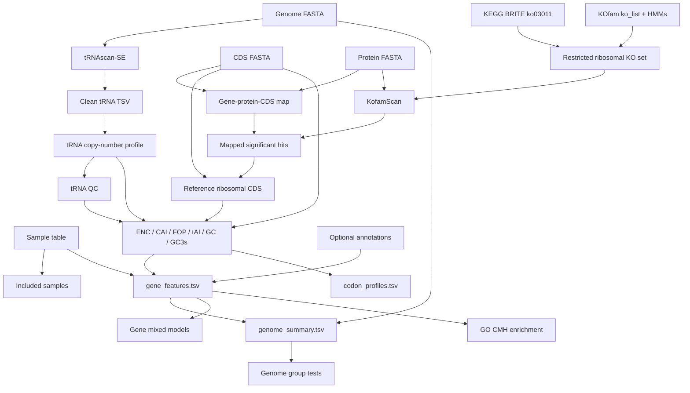

# Workflow overview

## Active rule order

| Step | Rule                                | Main result                              |
| ---: | ----------------------------------- | ---------------------------------------- |
|   00 | `prepare_go_dictionary`             | Local GO term lookup table               |
|   01 | `run_trnascanse`                    | Raw tRNA predictions per genome          |
|   02 | `convert_trnascanse_output_to_tsv`  | Clean tRNA table                         |
|   03 | `prepare_trna_codon_counts_to_tai`  | Amino-acid–anticodon copy numbers        |
|   04 | `validate_trna_profile`             | tRNA profile QC                          |
|   05 | `build_gene_protein_map`            | Protein–gene–CDS ID mapping              |
|  06a | `prepare_kofam_ribosomal_reference` | Restricted ribosomal KO/HMM list         |
|  06b | `run_kofamscan_ribosome`            | Ribosomal KOfamScan hits per proteome    |
|  06c | `parse_kofamscan_ribosome`          | Significant mapped ribosomal annotations |
|  06d | `extract_ribosomal_reference_cds`   | Reference CDS used for CAI               |
|   07 | `codon_usage_metrics`               | Per-gene and per-codon metrics           |
|  08a | `build_gene_features`               | Canonical gene table                     |
|  08b | `build_genome_summary`              | Canonical genome table                   |
|  08c | `build_codon_profiles`              | Canonical codon table                    |
|   09 | `compute_statistics`                | Gene- and genome-level tests             |
|   10 | `compute_go_enrichment_cmh`         | High/low-tAI GO enrichment               |

## Data flow



## Per-sample branch

For each included sample, the tRNA branch and KofamScan branch can run independently. Both must finish before codon metrics are calculated:

```text
tRNA counts + tRNA QC + all CDS + ribosomal reference CDS
    -> codon_usage_metrics
```

The ribosomal reference is sample-specific. It is built from significant KofamScan assignments to cytosolic eukaryotic ribosomal KOs and then converted from protein IDs to exact CDS IDs.

## Global branch

After all per-sample summaries exist, three canonical tables are built:

```text
gene_features.tsv
    -> genome_summary.tsv
    -> statistical tests

per-sample codon tables
    -> codon_profiles.tsv

gene_features.tsv + GO dictionary
    -> go_enrichment.tsv
```

## Failure policy

The workflow stops on structural inconsistencies that can invalidate results, including:

- zero or multiple files matching a sample pattern;
- duplicated sample, protein or CDS identifiers;
- CDS protein IDs absent from the proteome;
- missing KOfam profiles or required thresholds;
- significant KofamScan hits that cannot be mapped to CDS IDs;
- fewer than five valid ribosomal reference CDS;
- malformed tRNA count profiles.

`tRNA` threshold violations can be configured as `error`, `warn` or `ignore` through `trna_qc.mode`.

## Legacy files

Only files included by `workflow/Snakefile` are active. The current workflow uses numbered rules `00–10` and scripts in the corresponding subdirectories. Unnumbered rules and duplicate scripts are not executed.
